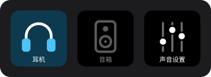

[English](README.md) | **简体中文**

# 音频切换 · Stream Deck Audio Switch

在 Stream Deck 上一键切换 Windows 的默认播放设备（比如耳机 ↔ 音箱），也可以一键打开“声音”控制面板。



## 功能

| 动作 | 说明 |
|---|---|
| 切换到耳机 / 切换到音箱 | 每个键绑定一个播放设备，按下就切过去。正在使用的设备对应的键会亮起，其他的变灰；在 Windows 里用别的方式切换，按键也会同步。 |
| 单键来回切换 | 一个键在两个设备之间来回切，图标显示当前设备。 |
| 打开声音设置 | 打开经典的“声音”控制面板（播放页）；已经打开的话就提到最前面。 |

- 切换类按键长按 0.5 秒也会打开“声音”设置。
- 切换时同时设为“默认设备”和“默认通信设备”，和声音面板里的“设为默认值”效果一样。
- 设备没连接时按键会显示警告；设备 ID 变了会按名称重新找到。

## 安装

需要 Windows 10/11 和 Stream Deck 软件 6.5 以上。

**直接安装：** 在 [Releases](https://github.com/NiseMonox/streamdeck-audio-switch/releases/latest) 下载 `com.nisemonox.audioswitch.streamDeckPlugin`，双击即可装进 Stream Deck。

**从源码编译：** 不需要额外安装运行库或第三方工具，用 Windows 自带的 .NET Framework C# 编译器编译。

```powershell
git clone https://github.com/NiseMonox/streamdeck-audio-switch.git
cd streamdeck-audio-switch
powershell -ExecutionPolicy Bypass -File .\build.ps1 -Install
```

`-Install` 会编译、把插件复制到 `%APPDATA%\Elgato\StreamDeck\Plugins`，然后重启 Stream Deck；`-Package` 则在 `dist\` 生成可以双击安装的 `.streamDeckPlugin`（Releases 里的文件就是这样生成的）。

装好后，在 Stream Deck 软件右侧的“音频切换”分类里把动作拖到按键上，在下方的下拉框里选设备即可。

## 命令行

编译出来的 `AudioSwitch.exe` 也能单独用，比如给其他工具调用：

```text
AudioSwitch.exe list                     列出播放设备（* 表示当前默认）
AudioSwitch.exe set <设备>                切换到某个设备
AudioSwitch.exe toggle <设备A> <设备B>     在两个设备之间切换
AudioSwitch.exe panel                    打开“声音”设置
```

`<设备>` 可以是设备 ID，也可以是设备名称的一部分，例如 `iFi`。

## 实现

- 用 Core Audio API（`IMMDeviceEnumerator`、`IMMNotificationClient`）列出设备、监听默认设备的变化。
- 设置默认设备用的是未公开的 `IPolicyConfig` 接口。“声音”控制面板自己也用它，从 Windows 7 起一直可用。
- 插件本体是一个 C# 程序（[`src/AudioSwitch.cs`](src/AudioSwitch.cs)，C# 5 / .NET Framework 4.x），通过 Stream Deck SDK v2 的 WebSocket 协议和 Stream Deck 通信；设置界面是 [`pi/inspector.html`](com.nisemonox.audioswitch.sdPlugin/pi/inspector.html)。
- 运行日志写在已安装插件目录下的 `AudioSwitch.log`。

## 许可证

[MIT](LICENSE)
